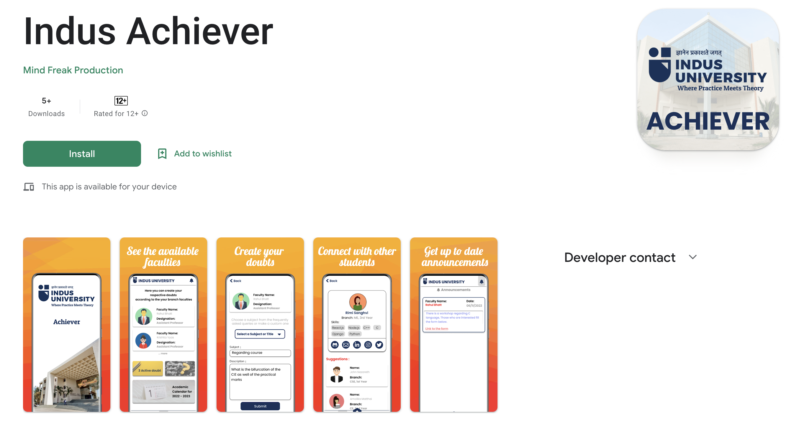
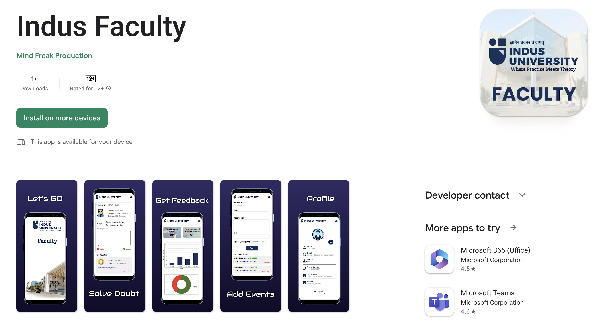
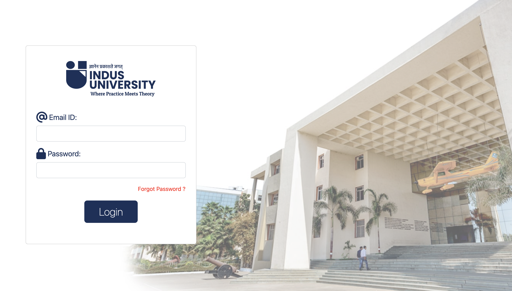
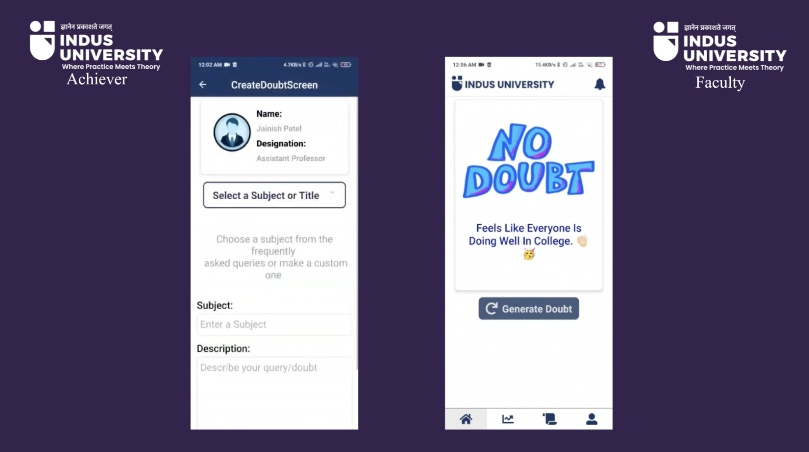

# IndusUniApp

## Indus Achiever: This aims to solve the doubts and queries of all the students of Indus University. The application has been designed with a user-friendly interface and advanced features that will make it easier for you to resolve doubts which were earlier solved via email.

 

## Indus Faculty: is designed to solve the doubts raised by students on another app named Indus Achiever. The application will provide a platform for students to connect with their respective faculty members and get their doubts cleared in a timely and efficient manner.

 

## Admin Portal: is designed to manage faculties like to Add and Remove them. Apart from this action against reported students can also be taken.

 

### Under this name Three different mobile based applications are there namely IndusAchiever, IndusFaculty, and AdminPortal.

 
 

# Google Playstore links

## [Indus Achiever](https://play.google.com/store/apps/details?id=com.indus.achieverapp)

### [https://play.google.com/store/apps/details?id=com.indus.achieverapp](https://play.google.com/store/apps/details?id=com.indus.achieverapp)

 

  

 
 

## [Indus Faculty](https://play.google.com/store/apps/details?id=com.indus.facultyapp)

### [https://play.google.com/store/apps/details?id=com.indus.facultyapp](https://play.google.com/store/apps/details?id=com.indus.facultyapp)

 

  

 
 

## [Admin Portal](https://indusuniadminportal.netlify.app)

### [https://indusuniadminportal.netlify.app](https://indusuniadminportal.netlify.app)

 

  

 
 

# Application Usage Demo Video

### [Youtube Video Link](https://youtu.be/qSjtPJ-du-c)

#### Kindly Follow the link to get better understanding of the application usage. 

  

 

# Tech Stack

### Mobile application:

- #### React.native

### Website:

- #### Frontend: React.js
- #### Backend: node.js

### Database:

- #### FireBase
